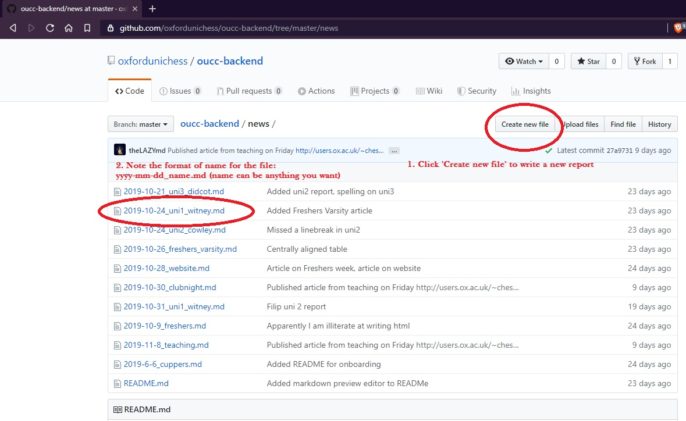
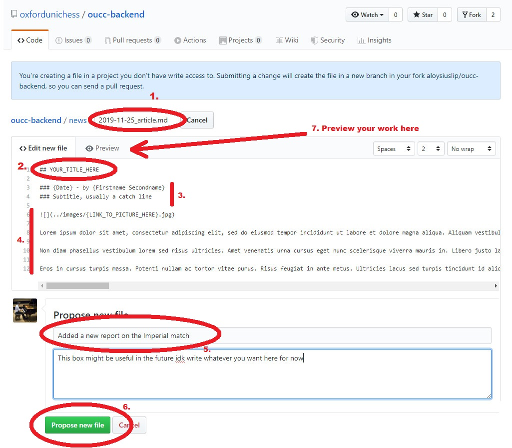
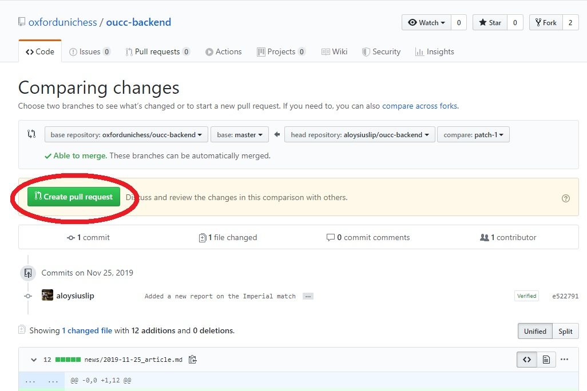

# Onboarding

If you've used git before, just go ahead and fork the repository! Otherwise read the follwoing steps to learn how to do it.

# Getting Started

Set up your workspace for adding your file is really easy, just press the 'Create new file' button. To edit an old file, just click on it.

# Adding details to your file

There's a few elements you need to add to your file.

### 1. The filename

Should be in the format **yyyy-mm-dd_name.md**. Make sure you write `.md` at the end or it won't work! The date controls the order of where it appears on the page. 

### 2. The header

ex: `## Intro to editing on GitHub`. Call it something short and catchy. Preface it with two hashes (`##`)

### 3. The subtitle

ex: Usually write the date, the author, and where the event took place here. Plus a catchy subtitle if you can - think Cherwell or the Economist. Preface each one with three hashes (`###`).

### 4. The body

THe main content of your article! Copy and paste it in from a draft in Word if you so wish. I'd try and make this fairly succint - if you see how they get displayed [on the website](http://users.ox.ac.uk/~chess/curr_news) you'll see that shorter is better. Maybe if we switch to whole-page articles in the future longer will be better.

See below for guidance on editing style.

### 5. The 'change message'

You're done! Now you need to just summarise what you've done for reference purposes. That's in the first box at the bottom. Only needs to a short half-sentence, like `Added a new article on uni1 match` or `Fixed punctuation in FWS report`.

### 6. Press the submit buttons twice.

- The first one is a `Propose New File` button circled in the above image.
- The second one is a `Create pull request` button on the next page.

Both are highlighted green. You **must** click both.

### 7. Press the 'preview' button at any time on the editing page to preview your changes.

At the top, right above your title, there should be a preview button. Will let you view your changes.

# Editing format

Copy and paste the [template](https://github.com/oxfordunichess/oucc-backend/blob/master/news/yyyy-mm-dd_TEMPLATE.md) to get started easily.

So all these articles are written in **markdown** and automatically compiled to the website. Markdown is just a super easy way to format things, you're probably already familiar with it from popular messaging sites such as *Reddit*, *WhatsApp*, or *Discord*. It's just really basic things, like:

- Begin each document with a `## Your Title` and then a `### Date - Your Name` subtitle.
- `**bold**` text is written with two stars around it.
- `*italic*` text is written with one star.

### Images

Should be done in the format:

``

or `.png` or whatever file-extension. Upload your image to the [`/images`](https://github.com/oxfordunichess/oucc-backend/tree/master/images) folder. Alternatively you can link to an external site by replacing the entire content in the `()`. Example:

``
``

### Further Reference

Check [this document](https://github.com/adam-p/markdown-here/wiki/Markdown-Cheatsheet) if you want to see a full reference.

Alternatively, use this [markdown preview editor](https://stackedit.io/app) to see how your formatting would directly render. Just type what you see!